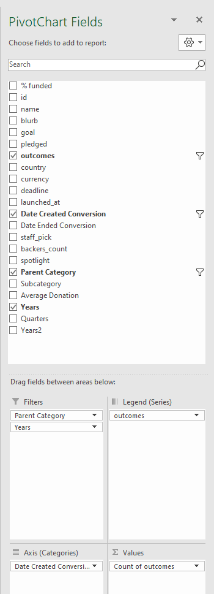
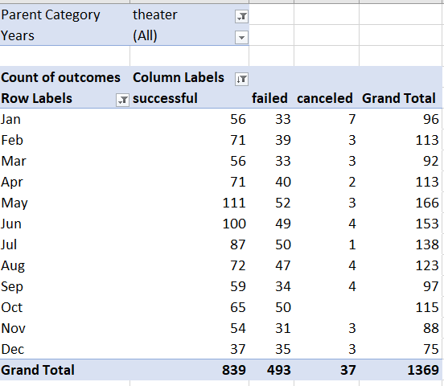
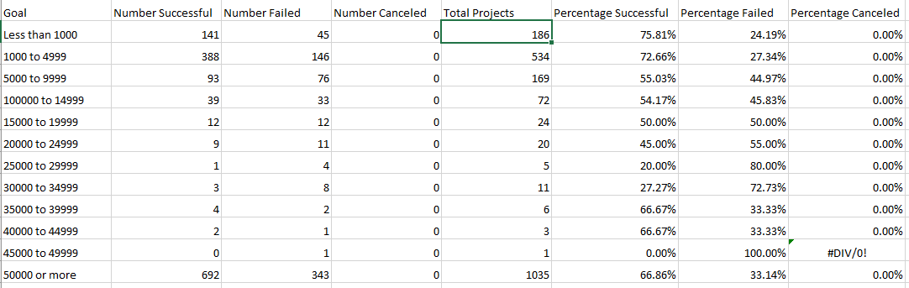
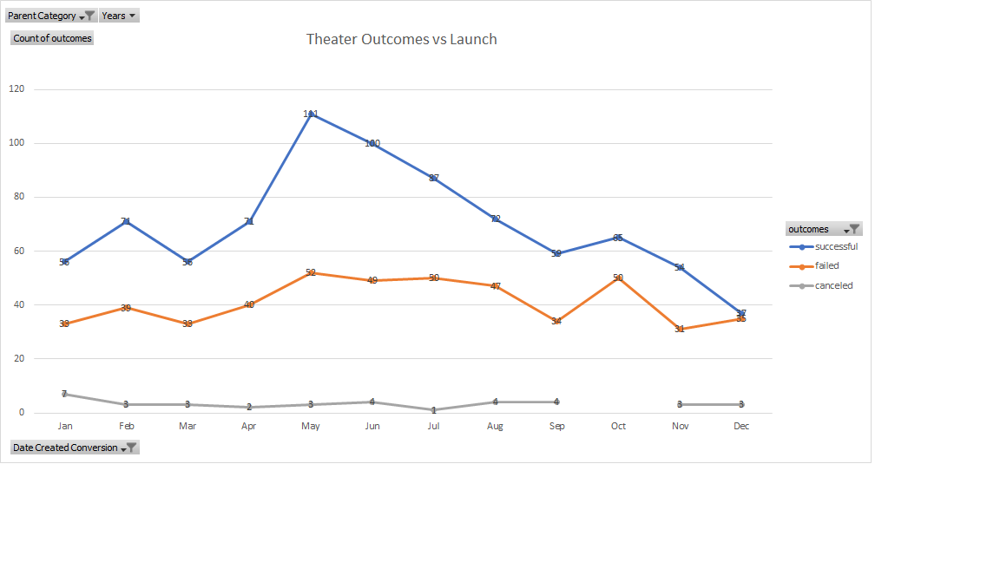
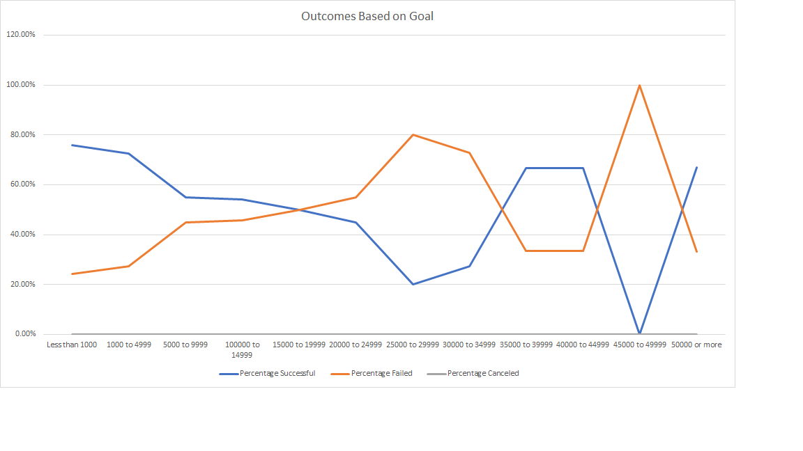
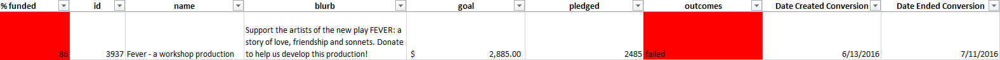

# **Kickstarting with Excel**

## **Overview of Project**
##### Kickstarter is where creators share new new projects, ideas and products to raise funding for them. Creators set a funding goal, launch date and a deadline. They also create reward levels for backers who pledge specific amounts. The more a backer pledges, the bigger the reward for the indiviual who donated. When backers have contributed enough to  a creator's project, the creator can successfully produce their vision. 
---
### **Purpose**
##### Our client's theatre play "Fever" came close to its Kickstarter fundraising goal in a short amount of time.  The client wanted to know how other theatre Kickstarter campaigns performed in relation to their launch dates and their funding goals. 

##### To answer this question we need to determine the Kickstarter outcomes based on launch date and the Kickstarter outcomes based on goals for theatre plays. The "Outcomes" tells us if the Kickstarter campaign met its goal.  "Goals" tells us how much money each campaign will need to succeed.
---
## **Analysis and Challenges**
##### *Explain how you performed your analysis using images and links to code, as well as any challenges you encountered and how you overcame them. If you had no challenges, describe any possible challenges or difficulties that could be encountered.*

##### First I formatted my data to separate the main categories to focus on Kickstarter projects similar to my client's theatre play. Formatting also allowed me to highlight those campaign's outcomes; successful, canceled and failed.  I changed the the campaign launch dates to readable format as opposed to the UNIX timestamp displayed in the data. I created new columns that shows the years based on data in the "launched at" column.   

##### Next, to show Theatre outcomes in relation to their launch dates, I created and filtered a pivot table based on the “Parent Category” "Theatre" and "years".  I listed "outcomes" and "date created conversion" in the columns and rows field. I filtered the date created coversion by months to show the best and worst times to launch a Theatre Kickstarter campaign.  

##### It was very challenging to display the outcomes by month since it was not a separate column on my spreadhsheet. This piece of information was important because without it, I would not be able to tell my client when the most successful launch dates were. I was eventually able to filter the "Date Created Conversion" on the pivot table to display the count of kickstarter outcomes by months. 

###  -  

##### In order to show outcomes based on Kickstrarter Goals, I divided possible goals into goal buckets ranging from "less than $1000" USD to "$50000 or more" as seen on the table below.  Next using the COUNTIFS function,   calculated the number of successful, failed and canceled theatre plays within each goal bucket. To clearly visualize the goal amounts of the most and least successful campaigns, I calculated the percentages of the outcomes of each goal bucket by dividing the outcomes by thhe total projects in each goal bucket. 

##### One challenged I faced when attempting to visualize the "outcomes based on goals" was calculating the outcomes using the COUNTIFS formula. When I made my first attempt to use this formula, I left a very important criteria out of my formula; the subcartegory of "plays".  If I didn't catch this mistake my presentation to the client would'nt be accurate. 

 

### Analysis of Outcomes Based on Launch Date
##### *What are two conclusions you can draw about the Theater Outcomes by Launch Date?*
##### 	From the Outcomes Based on Goals chart we can see that Theatre Kickstarter campaigns were mostly successful if launched in May and June.  

### Analysis of Outcomes Based on Goals
##### *What can you conclude about the Outcomes based on Goals?*
##### Theatre Kickstarter campaigns with goals less than $5000 are more successful. 

### Challenges and Difficulties Encountered
##### *What are some limitations of this dataset?*
##### We are unable to if the length of the campaign has any relation to its campaign success or failure. 
	
##### *What are some other possible tables and/or graphs that we could create?* 
---
## **Results**

